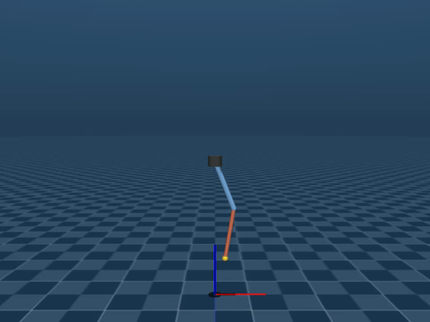

# Optimal Control of an Underactuated Rotary Double Pendulum

A systematic comparison of **LQR**, **iLQR**, and **nonlinear MPC** on a rotary double pendulum — two degrees of freedom, one actuator, unstable upright equilibrium. All three controllers are evaluated under identical conditions in a shared MuJoCo simulation across 13 test scenarios covering sensor noise, actuator limits, model mismatch, and impulse disturbances.

> **ME/SE 701 Final Project — Boston University, Spring 2026**  
> Full write-up: [`docs/report.pdf`](docs/report.pdf) · Poster: [`docs/poster.pdf`](docs/poster.pdf)

---

## Demo

*MPC swing-up, stabilisation, and recovery from a 1 Nm·s impulse disturbance at t = 2 s*



---

## Key Results

| Scenario | LQR | iLQR | MPC |
|---|:---:|:---:|:---:|
| Nominal | ✓ | ✓ | ✓ |
| Sensor noise (low / mid) | ✓ | ✓ | ✓ |
| Sensor noise (high) | ✗ | ✗ | ✗ |
| Torque limit 2 Nm | ✗ | ✗ | ✓ |
| Torque limit 1 Nm | ✗ | ✗ | ✓ |
| Model mismatch (low / mid) | ✗ | ✓ | ✓ |
| Model mismatch (high) | ✓ | ✗ | ✗ |
| Impulse disturbances (l/m/h) | ✓ | ✓ | ✓ |
| Combined stress | ✗ | ✗ | ✗ |
| **Total** | **7/13** | **7/13** | **10/13** |

MPC's advantage comes entirely from enforcing torque constraints inside the optimisation. LQR and iLQR both fail every torque-limited scenario for structurally different reasons — LQR clips output blindly; iLQR's offline plan was computed at full authority. On embedded hardware (Raspberry Pi 3B+), MPC's worst-case solve time reaches **621 ms**, making hard real-time scheduling infeasible, while iLQR's cost is bounded and predictable.

**Practical selection criterion:**
- **LQR** — near-equilibrium operation, low-noise sensing, any hardware
- **iLQR** — full nonlinear swing-up, hard real-time on embedded hardware
- **MPC** — constraint-critical applications with sufficient compute

---

## Implementation

**Controllers** each subclass a shared `BaseController` with a single `_compute(state, t) → torque` method. Physics and control run in separate OS processes connected via shared memory — the simulation clock never stalls waiting for the controller, which is particularly relevant for MPC where each solve takes ~8 ms on desktop.

| Controller | Key design choices |
|---|---|
| LQR | Passivity-based energy-shaping swing-up → four-condition catch → infinite-horizon LQR gain (DARE) |
| iLQR | Offline trajectory optimisation (7 warm-start seeds) + short-horizon online replanning; RK4 integration |
| MPC | Direct multiple-shooting (N=20, Δt=0.04 s), CasADi/IPOPT, DARE-based terminal cost |

---

## Repository Structure

```
├── main.py
├── config.yaml
├── controller/
│   ├── base_controller.py
│   ├── lqr_controller.py
│   ├── ilqr_controller.py
│   └── mpc_controller.py
├── src/                     # simulation internals
│   ├── double_pendulum.py
│   ├── simulation.py
│   ├── metrics.py
│   └── system_params.py
├── model/
│   └── scene.xml
├── analysis/
│   └── general_analysis.ipynb
└── docs/
    ├── report.pdf
    └── poster.pdf
```

---

## Installation

```bash
conda create -n dp-control python=3.10
conda activate dp-control
pip install -r requirements.txt
```

Run a single scenario:

```bash
python main.py  # scenario set in config.yaml
```

Results are logged to `log/` as `.h5` trajectory files. Open `analysis/general_analysis.ipynb` to plot and compute metrics.